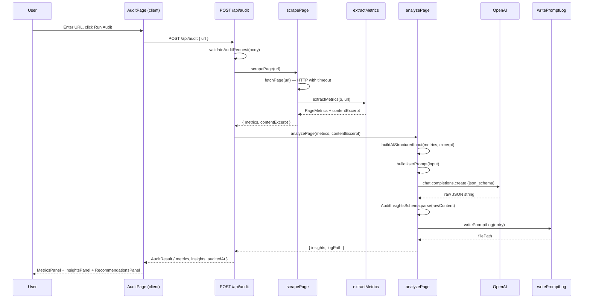

# Architecture — Website Audit Tool

This document describes the internal architecture of the EIGHT25MEDIA Website Audit Tool: a Next.js 15 App Router application that fetches a single URL, extracts factual metrics deterministically, and generates structured AI insights using OpenAI gpt-4o.

---

## Overview

The application follows a strict unidirectional pipeline with enforced layer boundaries. Each layer has a single responsibility and a clearly defined interface. The most important invariant: **no layer may import from a layer above it**, and **the AI layer never receives raw HTML**.

```
scraper/ → metrics/ → ai/ → logging/
```

All of these are orchestrated by the API route (`src/app/api/audit/`), which is the only entry point for an audit request.

---

## Data Flow



---

## Layer Responsibilities

| Layer | Directory | Owns | Forbidden |
|-------|-----------|------|-----------|
| **Scraper** | `src/lib/scraper/` | HTTP fetch with timeout and User-Agent; Cheerio DOM loading; public `scrapePage()` entrypoint | OpenAI imports; metric logic |
| **Metrics** | `src/lib/metrics/` | Pure extractor functions for each metric group; `extractMetrics()` orchestrator; `contentExcerpt` extraction | OpenAI imports; fetch logic |
| **AI** | `src/lib/ai/` | `AIStructuredInput` assembly; system and user prompt rendering; OpenAI API call with `json_schema` output; Zod validation; retry logic | Direct fetch; Cheerio |
| **Logging** | `src/lib/logging/` | Markdown prompt log formatting; filesystem write (`docs/prompt-logs/{date}/`) | Business logic; metric extraction |
| **API route** | `src/app/api/audit/` | Request validation; pipeline orchestration; typed error mapping to HTTP responses | Inline prompts; direct OpenAI calls |
| **UI** | `src/app/`, `src/components/` | Client state machine (`useAudit`); form; results panels with visual separation | Any server-side logic; AI imports |
| **Types** | `src/types/` | Zod schemas and inferred TypeScript types shared across all layers | Implementation logic |

---

## Key Files

```
src/
├── app/api/audit/route.ts            # POST /api/audit — orchestration only
├── lib/
│   ├── scraper/
│   │   ├── fetch-page.ts             # fetch() with 10s timeout + User-Agent
│   │   ├── parse-html.ts             # Cheerio DOM loader
│   │   ├── errors.ts                 # FetchError, ParseError
│   │   └── index.ts                  # scrapePage() public API
│   ├── metrics/
│   │   ├── extract-meta.ts           # metaTitle, metaDescription
│   │   ├── extract-headings.ts       # h1Count, h2Count, h3Count
│   │   ├── extract-word-count.ts     # wordCount (prefers <main>)
│   │   ├── extract-links.ts          # internalLinks, externalLinks
│   │   ├── extract-images.ts         # imageCount, altTextPercent
│   │   ├── extract-ctas.ts           # ctaCount (heuristic)
│   │   ├── extract-content-excerpt.ts# plain-text excerpt, max 5000 chars
│   │   └── index.ts                  # extractMetrics() orchestrator
│   ├── ai/
│   │   ├── prompts/
│   │   │   ├── system.ts             # Static system prompt
│   │   │   └── user-template.ts      # Dynamic user prompt builder
│   │   ├── build-input.ts            # AIStructuredInput assembly
│   │   ├── schema.ts                 # JSON schema for OpenAI response_format
│   │   ├── openai-client.ts          # callOpenAI() — single OpenAI wrapper
│   │   ├── analyze-page.ts           # analyzePage() — full AI orchestrator
│   │   ├── constants.ts              # AUDIT_MODEL, CONTENT_EXCERPT_MAX_LENGTH
│   │   ├── errors.ts                 # AnalysisError, ValidationError, etc.
│   │   └── index.ts                  # Re-exports analyzePage()
│   ├── api/
│   │   ├── validate-request.ts       # Zod-based request body validation
│   │   └── map-error.ts              # Domain error → HTTP response mapping
│   └── logging/
│       └── prompt-logger.ts          # formatPromptLogMarkdown + writePromptLog
├── components/
│   ├── AuditPage.tsx                 # Top-level client component + state layout
│   ├── AuditForm.tsx                 # URL input form
│   ├── AuditResults.tsx              # Container with metric/AI visual separator
│   ├── MetricsPanel.tsx              # Factual metrics grid (blue)
│   ├── InsightsPanel.tsx             # 5 AI insight categories (violet)
│   └── RecommendationsPanel.tsx      # Priority-sorted recommendations (amber)
├── hooks/
│   └── use-audit.ts                  # Client state machine: idle/loading/success/error
└── types/
    ├── audit.ts                      # PageMetricsSchema, AuditInsightsSchema, AuditResultSchema
    ├── api.ts                        # AuditResponse, AuditErrorResponse
    └── prompt-log.ts                 # AIStructuredInput, PromptLogEntry
```

---

## Error Handling Strategy

Errors propagate upward through typed domain classes and are mapped to HTTP responses by `mapToAuditError()` in `src/lib/api/map-error.ts`.

| Error class | Source | HTTP status | Client code |
|-------------|--------|-------------|-------------|
| `ZodError` | `validateAuditRequest` | 400 | `INVALID_URL` |
| `FetchError` | `fetchPage` | 422 | `FETCH_FAILED` |
| `ParseError` | `parseHtml` | 422 | `PARSE_FAILED` |
| `MissingApiKeyError` | `callOpenAI` | 500 | `AI_FAILED` |
| `ValidationError` | `AuditInsightsSchema.parse` (after retry) | 502 | `AI_FAILED` |
| `OpenAIResponseError` | `callOpenAI` | 502 | `AI_FAILED` |
| `unknown` | Any unhandled error | 500 | `UNKNOWN` |

The client-side `useAudit` hook maps these to human-readable error messages displayed in the `ErrorState` component. Full error details are always logged server-side via `console.error`.

---

## Prompt Log Policy

Every `analyzePage()` call produces a prompt log entry regardless of success or failure.

**Development** (`NODE_ENV !== 'production'`):
Logs write to `docs/prompt-logs/{YYYY-MM-DD}/{uuid}.md`. This directory is gitignored; curated examples must be manually promoted to `docs/prompt-logs/examples/`.

**Production (Vercel)**:
Logs write to `/tmp/prompt-logs/{uuid}.md`. The `/tmp` filesystem is ephemeral and not persisted between invocations. Prompt logs must be generated and curated locally.

Each log contains:

1. Full system prompt text
2. Rendered user prompt (metrics JSON + content excerpt)
3. `AIStructuredInput` as JSON (what the model actually received)
4. Raw model output string (before Zod parsing)
5. Model name, timestamp, URL, token usage

See `docs/prompt-logs/README.md` for the full format specification.

---

## CTA Detection Heuristic

`src/lib/metrics/extract-ctas.ts` counts CTAs by matching:

- All `<button>` elements
- Elements with `role="button"`
- `<a>` tags whose class contains: `btn`, `cta`, `button`, `action`
- `<a>` tags whose link text matches: `get started`, `contact`, `sign up`, `learn more`, `request`, `book`, `download`, `try`, `start`

**Known limitations:** JavaScript-rendered buttons (React portals, SPAs), CSS-only styled CTAs, and elements outside the DOM at fetch time are not detected. `ctaCount` should be treated as a lower-bound estimate.

---

## Trade-offs

| Trade-off | Decision | Rationale |
|-----------|----------|-----------|
| Cheerio vs Playwright | Cheerio | Zero browser dependency; simpler deployment; JS-rendered CTAs are a documented limitation |
| `json_schema` response format | Structured output | Eliminates fragile prose parsing; Zod validation catches schema violations at the API boundary |
| 5000-char excerpt | Fixed limit | Balances token cost against content coverage; documented in prompt logs so reviewers can see what the model saw |
| Single retry on validation failure | `MAX_VALIDATION_RETRIES = 1` | Handles rare model lapses without infinite loops or significant latency increase |
| Vercel Hobby timeout | `maxDuration = 60` (Pro only) | Hobby plan caps at 10s; documented in README; upgrade path is clear |
| No caching | Stateless per-request | Simplest deployment; appropriate for an assignment-scope tool |
